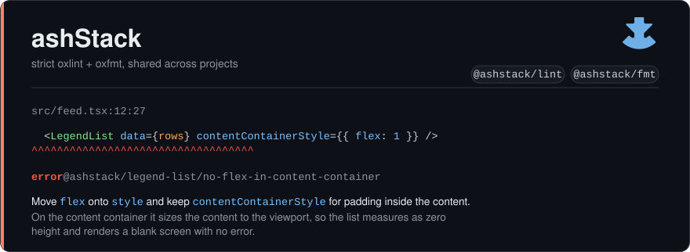

<p align="center">
  
</p>

<p align="center">
  <a href="https://www.npmjs.com/package/@ashstack/lint"></a>
  <a href="https://www.npmjs.com/package/@ashstack/lint"></a>
  <a href="https://github.com/AlshehriAli0/ashStack/actions/workflows/ci.yml"></a>
</p>

---

Two packages: [`@ashstack/lint`](packages/lint) and [`@ashstack/fmt`](packages/fmt). Install once per project instead of copying a lint config around and watching the copies drift.<!-- rule-counts -->

- **118 rules** on plain TypeScript, **201** with React, **257** on React Native, 74 of them custom-built
- library-specific rules ship only when you depend on that library: 13 self-detecting modules<!-- /rule-counts -->
- every rule is in [RULES.md](packages/lint/RULES.md), with options and examples, generated and CI-checked
- your `rules` block always wins

## Install

```sh
bun add -d oxlint oxfmt oxlint-tsgolint @ashstack/lint @ashstack/fmt
```

```ts
// oxlint.config.mts
import { core } from "@ashstack/lint/core"; // or: /react, /react-native
import { defineConfig } from "oxlint";

export default defineConfig({ extends: [core()] });
```

```ts
// oxfmt.config.mts
import fmt from "@ashstack/fmt";
export default fmt;
```

```sh
oxlint --type-aware --deny-warnings .
oxfmt --check .
```

Keep the `defineConfig` wrapper: it types the `rules` block, so a wrong rule
option is a compile error and hovering a rule id documents it.

> `.mts` config files are the only supported path: oxlint's JSON `extends` can't resolve npm packages, and oxfmt has no `extends` at all. Needs Node 22.18+.

## Why it's this strict

An agent writes more code in an hour than anyone reads line by line, and unchecked it tangles: modules wound into each other, one problem solved three ways. Most of these rules exist to stop that.

The rest encode how a library expects to be used, so its anti-patterns get caught the first time. Every message names the fix.

## Three entries

Each returns one flat config. `react()` contains `core()`; `react-native()` contains both.

| Entry            | For                    | Adds                                                                                                        |
| ---------------- | ---------------------- | ----------------------------------------------------------------------------------------------------------- |
| `core()`         | any TypeScript project | strict eslint / typescript / unicorn / promise / import base, plus `@ashstack/core/` conventions            |
| `react()`        | React on the web       | react, jsx-a11y, react-perf, React Compiler, you-might-not-need-an-effect, `@ashstack/react/` accessibility |
| `react-native()` | Expo and React Native  | `@ashstack/react-native/`: leaked renders, view nesting, iOS-only keyboard events, remote images            |

`react()` and `react-native()` assume the React Compiler is on, so every rule whose whole complaint is "this value is allocated during render" ships off — the four `react-perf` inline-prop rules, `react/jsx-no-constructed-context-values` and `react/no-object-type-as-default-prop`. The compiler memoises exactly those, and their only suggested fix is a `useMemo` that `react/preserve-manual-memoization` then tells you to delete. Rules about identity the compiler does _not_ fix stay on: a nested component still remounts and loses its state, a dependency array is still yours to get right. Not using the compiler:

```ts
react({ reactCompiler: false });
```

## Library-specific rules, auto-detected

One module per library: one rule namespace, one toggle. A module turns on when its library is in your `package.json`, searched up to the repo root.

| Module                      | Detected from                                                                            |
| --------------------------- | ---------------------------------------------------------------------------------------- |
| `@ashstack/zod`             | `zod`                                                                                    |
| `@ashstack/query`           | `@tanstack/react-query`                                                                  |
| `@ashstack/zustand`         | `zustand`                                                                                |
| `@ashstack/i18n`            | i18next · react-i18next · lingui · react-intl · use-intl · next-intl · expo-localization |
| `@ashstack/tailwind`        | `tailwindcss`                                                                            |
| `@ashstack/tanstack-router` | `@tanstack/react-router`                                                                 |
| `@ashstack/unistyles`       | `react-native-unistyles`                                                                 |
| `@ashstack/legend-list`     | `@legendapp/list`                                                                        |
| `@ashstack/legend-state`    | `@legendapp/state`                                                                       |
| `@ashstack/reanimated`      | `react-native-reanimated`                                                                |
| `@ashstack/turbo-image`     | `react-native-turbo-image`                                                               |
| `@ashstack/skia`            | `@shopify/react-native-skia`                                                             |
| `@ashstack/keyboard`        | `react-native-keyboard-controller`                                                       |

Detection only sets the default. Turn any module on or off yourself, whatever your dependencies say:

```ts
reactNative({ unistyles: false, i18n: true });
```

## Overriding

```ts
export default defineConfig({
  extends: [reactNative()],
  rules: {
    complexity: ["error", { max: 20 }],
    "@ashstack/unistyles/no-margin": "off",
  },
});
```

Usual first cuts: `max-lines` (300), `max-lines-per-function` (120), `complexity` (12).

<!-- opt-in -->Off by default, since they need a team decision first: `@ashstack/core/use-design-system` and `@ashstack/core/components-tsx-only`.<!-- /opt-in -->

## Contributing

```sh
bun install
bun run test            # every custom rule and helper, asserted by message and position
bun run check:mutants   # breaks each rule on purpose; a test must notice
bun run lint            # this repo lints itself with core()
bun run check:smoke     # a real consumer app, end to end
bun run docs:rules      # regenerate RULES.md
```

Rule tests live in `tests/`, one file per module, and run through real oxlint. A case names the code, the expected message and the line it lands on. 1800 of them finish in a second: bun runs the files in parallel, and each file lints all its cases at once. `check:mutants` then flips an operator in each compiled rule and re-runs that module's tests: a change no test notices is a hole in the suite.

Add a [changeset](https://github.com/changesets/changesets) with your PR. Releases run from a manual CI dispatch, not from the merge.

## License

MIT
